# RCWX vs w-okada/voice-changer 推論パイプライン比較

RVCリアルタイムボイスチェンジャーの2つの実装を、推論パイプラインの観点から詳細に比較する。

- **RCWX**: Intel XPU向けに最適化されたネイティブデスクトップ実装
- **w-okada/voice-changer**: マルチモデル対応のサーバー・クライアント型フレームワーク

---

## 1. 全体アーキテクチャ

### 1.1 RCWX

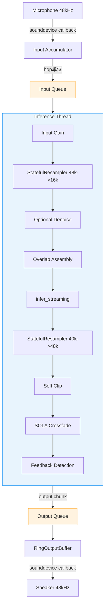

- 推論は専用スレッドで非同期実行
- 入出力は `sounddevice` コールバック駆動
- Queue によるバッファリングで I/O と推論を分離

### 1.2 w-okada/voice-changer

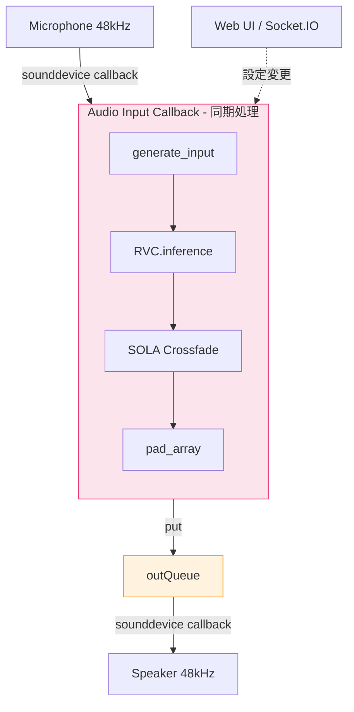

- 推論はオーディオ入力コールバック内で**同期実行**
- 推論がチャンク時間を超えるとフレームドロップが直接発生
- Web UI からの設定変更はリアルタイム反映

### 1.3 設計思想の比較

| 観点 | RCWX | w-okada |
|---|---|---|
| アプリ形態 | ネイティブ GUI (tkinter) | Web サーバー + ブラウザ UI |
| スレッドモデル | 推論専用スレッド (非同期) | コールバック内同期処理 |
| 対応モデル | RVC v2 専用 | RVC, MMVC, DDSP-SVC, Beatrice 等 8+ |
| 対象デバイス | Intel XPU (Arc) | CUDA / CPU / DirectML |
| 過負荷対策 | 自動品質退避 (F0/Index無効化) | フレームドロップ (暗黙) |

---

## 2. 推論パイプライン詳細フロー

### 2.1 RCWX: `infer_streaming()` フロー

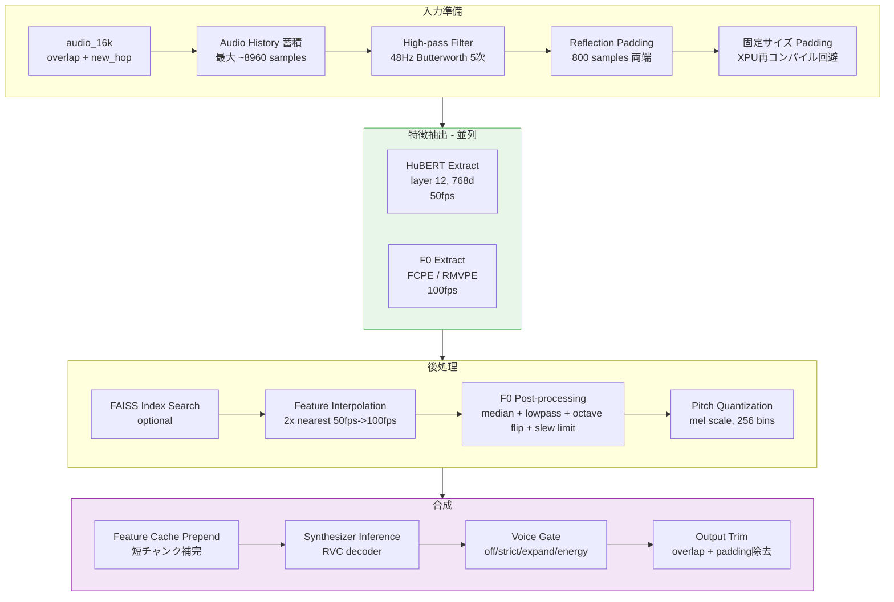

**特徴的な点**:
- HuBERT と F0 を `ThreadPoolExecutor` で**並列抽出** (~10-15% 高速化)
- Audio History を蓄積し HuBERT に豊富なコンテキストを提供
- 固定サイズパディングにより XPU カーネル再コンパイルを回避
- Feature Cache により短チャンク（初回2チャンク）でも実特徴量でデコーダーを補完

### 2.2 w-okada: `Pipeline.exec()` フロー

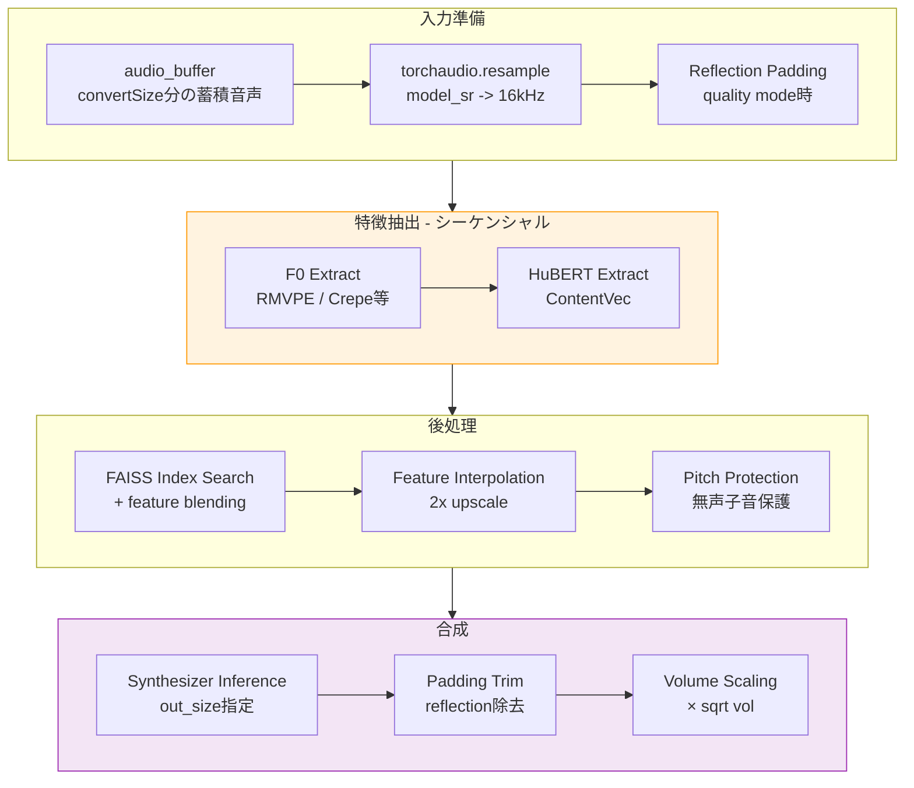

**特徴的な点**:
- HuBERT と F0 は**シーケンシャル実行** (並列化なし)
- `extraConvertSize` により大量のコンテキスト音声を投入
- `out_size` パラメータでシンセサイザー出力長を直接制御
- Pitch Protection で無声子音 (破裂音等) のindex変換を抑制

---

## 3. チャンクバッファレイアウト

推論に渡される音声データの構成が根本的に異なる。

### 3.1 w-okada のバッファ構成


```
|<-- extraConvertSize -->|<-- solaSearch -->|<-- crossfade -->|<-- block -->|
|     context only       |   SOLA search   |  crossfade zone |  new output |
|<-------------------------- convertSize (synth入力) ---------------------->|
                         |<------------------ outSize (synth出力) --------->|
```

- `convertSize` 全体をシンセサイザーに入力し、`outSize` だけ出力させる
- `extraConvertSize` はユーザーが手動調整可能 (4096 ~ 131072 samples)
- 128-sample 境界にアラインメント (シンセサイザーの hop size)

### 3.2 RCWX のバッファ構成


```
|<-- pad (800) -->|<-- overlap -->|<-- new_hop -->|<-- pad (800+extra) -->|
|   reflection    | 前チャンク尾  |   新規音声    |      reflection       |
```

さらに、HuBERT には別途蓄積した Audio History を連結:

```
|<-- history (最大 ~8960 samples) -->|<-- overlap -->|<-- new_hop -->|
|       _streaming_audio_history     | 前チャンク尾  |   新規音声    |
```

- 全て 320-sample (HuBERT hop) 境界にアラインメント
- HuBERT 入力は固定長にパディング (XPU 最適化)
- 出力トリムで overlap + padding + history 分をカット

### 3.3 コンテキスト戦略の比較

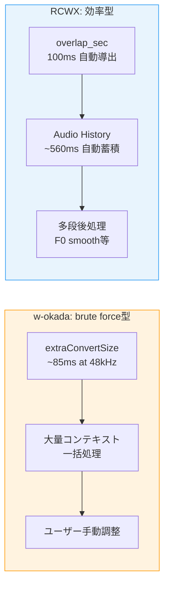

| 観点 | RCWX | w-okada |
|---|---|---|
| コンテキスト供給 | `overlap_sec` + Audio History (自動) | `extraConvertSize` (ユーザー設定) |
| 最大コンテキスト | ~560ms (自動上限) | ~3秒 (ユーザー設定次第) |
| 品質担保手段 | 多段後処理 (F0 smooth, feature blend) | 大量コンテキスト投入 |
| レイテンシ影響 | コンテキスト増でも推論時間ほぼ一定 | コンテキスト増で推論時間が線形増加 |

---

## 4. 特徴量抽出

### 4.1 HuBERT

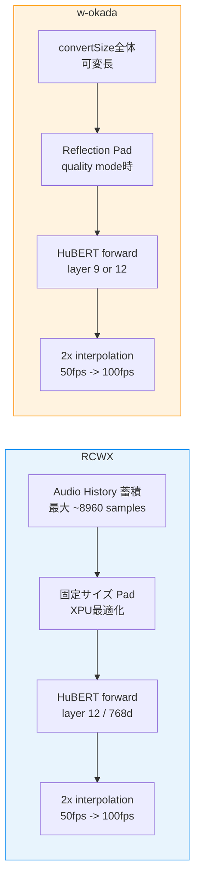

| 観点 | RCWX | w-okada |
|---|---|---|
| 入力 SR | 16kHz (事前リサンプル済み) | 16kHz (Pipeline.exec 内でリサンプル) |
| コンテキスト | `_streaming_audio_history` (最大 ~560ms) | `audio_buffer` 全体 (convertSize分) |
| パディング | **固定サイズ** (XPU カーネル再コンパイル回避) | 可変サイズ (チャンク毎に変動) |
| 出力 layer | v2: layer 12 / 768d | 設定可 (v1: layer 9/256d, v2: layer 12/768d) |
| 補間 | `F.interpolate(scale_factor=2, mode="nearest")` | 同一 |

**RCWX の固定サイズパディング**は Intel XPU 特有の最適化。XPU (oneAPI) はチャンク毎に入力サイズが変わるとカーネルを再コンパイルするため、初回チャンクで1回だけコンパイルし以降は再利用する設計:

```python
# rcwx/pipeline/inference.py (infer_streaming)
fixed_hubert_input = (
    (min_audio_for_full_features + 2 * t_pad + hubert_hop - 1)
    // hubert_hop * hubert_hop
)
if len(audio_padded) < fixed_hubert_input:
    end_pad = fixed_hubert_input - len(audio_padded)
    audio_padded = np.pad(audio_padded, (0, end_pad), mode="reflect")
```

### 4.2 F0 (ピッチ抽出)

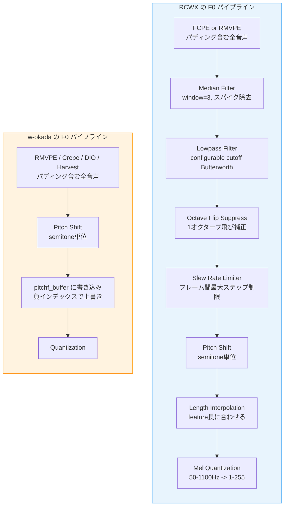

| 観点 | RCWX | w-okada |
|---|---|---|
| 既定手法 | FCPE (低レイテンシ) | RMVPE |
| 選択肢 | FCPE / RMVPE | RMVPE / Crepe / DIO / Harvest / FCPE |
| 並列化 | HuBERT と ThreadPoolExecutor で並列 | シーケンシャル |
| 後処理 | median + lowpass (configurable) + octave flip + slew limit | **なし** (生 F0 をそのまま使用) |
| キャッシュ | `_f0_cache` でチャンク境界値を保持 | `pitchf_buffer` で前チャンク値を保持 |
| 過負荷時 | `f0_method="none"` に自動退避 | なし |

RCWX の F0 後処理（median + lowpass + octave flip suppress + slew limit）により、チャンク境界でのピッチジャンプやフレーム間ジッターが軽減される。w-okada は `extraConvertSize` による大量コンテキストでF0境界品質を間接的に担保する。

---

## 5. SOLA クロスフェード

両実装とも SOLA (Synchronized Overlap-Add) を採用しているが、適用位置・窓関数・探索方法が異なる。

### 5.1 SOLA フロー比較

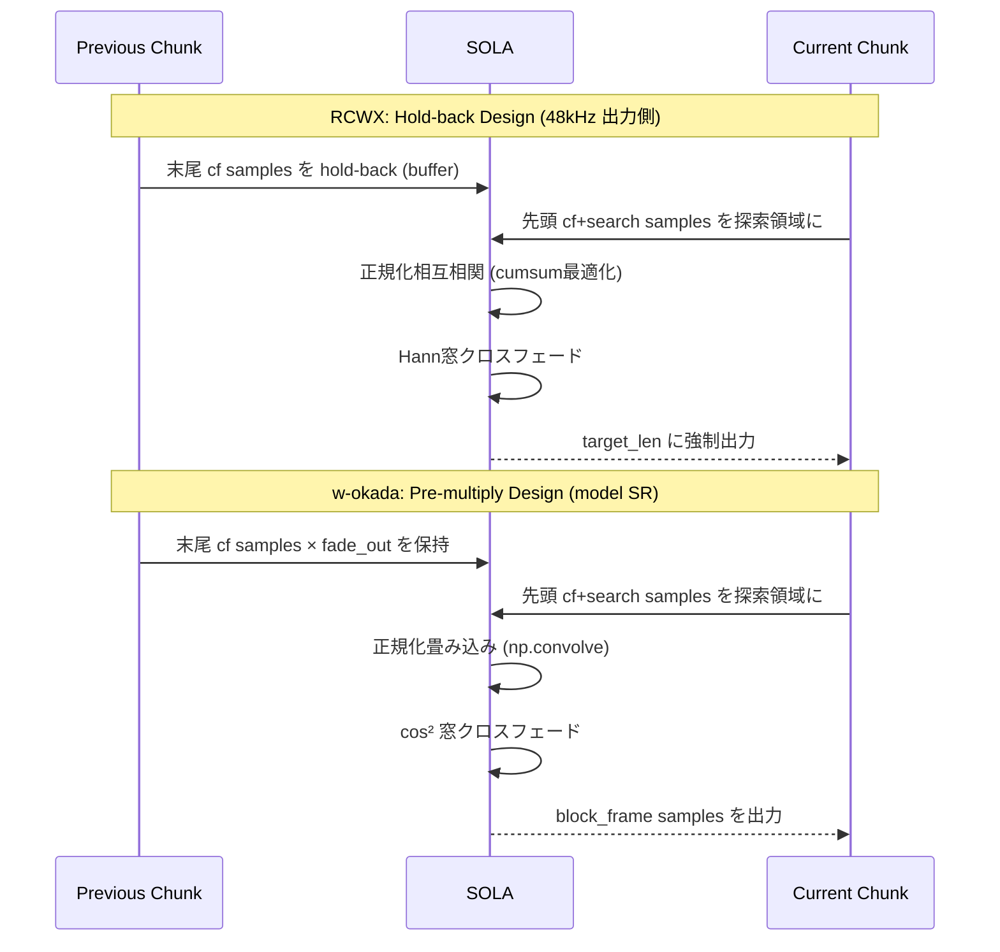

### 5.2 実装の詳細比較

| 観点 | RCWX | w-okada |
|---|---|---|
| 適用位置 | 出力 SR (48kHz) | model SR (32k/40k/48k) |
| 探索窓 | `sola_search_ms` (既定 10ms) | 12ms 固定 |
| クロスフェード長 | `crossfade_sec` (既定 50ms) | `crossFadeOverlapSize` (既定 4096 samples) |
| 窓関数 | **Hann** (対称) | **cos²** + offset/end margin (0.1/0.9) |
| 相関計算 | 正規化相互相関 (cumsum O(N)) | 正規化畳み込み (`np.convolve`) |
| バッファ保持 | 生波形を hold-back | fade-out 事前適用済み |
| 出力長制御 | `target_len` で厳密制御 | block_frame 固定 |
| ドリフト防止 | あり (`target_len` 強制) | なし |

### 5.3 窓関数の違い

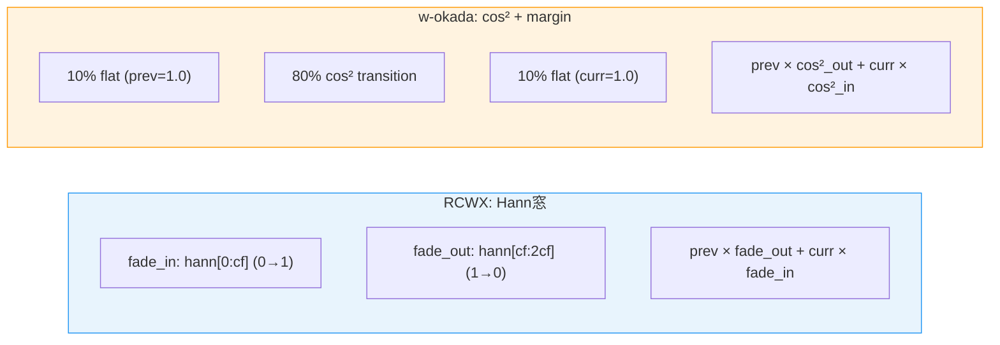

w-okada の cos² + margin 方式は、クロスフェード領域の両端にフラット区間 (10%) を設けることで、遷移境界でのアーティファクトを軽減する。RCWX の Hann 窓は標準的だが、cos² と比較して遷移の滑らかさはほぼ同等。

### 5.4 SOLA 相関計算の計算量

**RCWX** (`_find_best_offset`):

```python
# O(N) cumsum ベースの正規化相互相関
dots = np.correlate(region, pt_centered, mode="valid")  # C実装
# per-window norms via cumulative sums (大きな中間配列なし)
cumsum = np.cumsum(x)
cumsum_sq = np.cumsum(x * x)
norms = sqrt(window_sq_sums - window_sums² / cf)
corrs = dots / (pt_norm * norms)
```

**w-okada**:

```python
# np.convolve ベース
cor_nom = np.convolve(audio[:cf + search], np.flip(sola_buffer), "valid")
cor_den = np.sqrt(np.convolve(audio[:cf + search]**2, np.ones(cf), "valid") + 1e-3)
sola_offset = argmax(cor_nom / cor_den)
```

両者とも計算量は `O(cf × search)` だが、RCWX は中間配列の生成を抑えたメモリ効率の良い実装。

---

## 6. リサンプリング

### 6.1 アプローチの違い

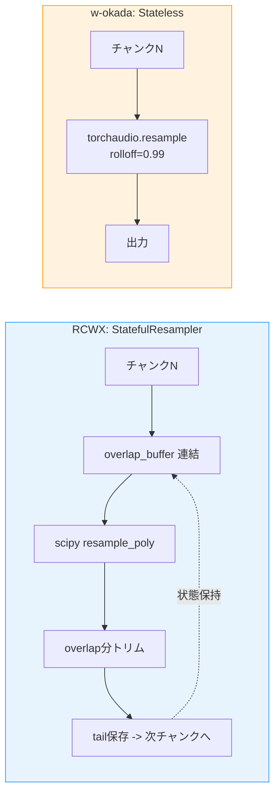

| 観点 | RCWX | w-okada |
|---|---|---|
| 方式 | `StatefulResampler` (overlap-save) | `torchaudio.functional.resample` |
| 状態保持 | あり (フィルタ位相連続) | なし (チャンク独立) |
| 品質 | バッチ比 ~0.98+ 相関 | チャンク境界にフィルタ過渡応答 |
| 入力パス | mic 48k -> 16k | model_sr -> 16k |
| 出力パス | model_sr 40k -> 48k | 不要 (model_sr = 出力SR の場合が多い) |

**StatefulResampler の動作原理**:

```
チャンク 1:
  [chunk1 + zero_pad] → resample → output1
  tail保存: chunk1[-overlap:]

チャンク 2:
  [saved_tail | chunk2] → resample → output2
  overlap分をトリム → phase-aligned output
  tail保存: chunk2[-overlap:]
```

これにより、チャンク境界でのフィルタ過渡応答 (transient) が除去され、バッチ処理とほぼ同等の品質を実現する。w-okada は各チャンクを独立にリサンプルするため、境界にわずかなアーティファクトが生じるが、SOLA クロスフェードで隠蔽される。

---

## 7. Voice Gate / サイレンス処理

### 7.1 処理フロー比較

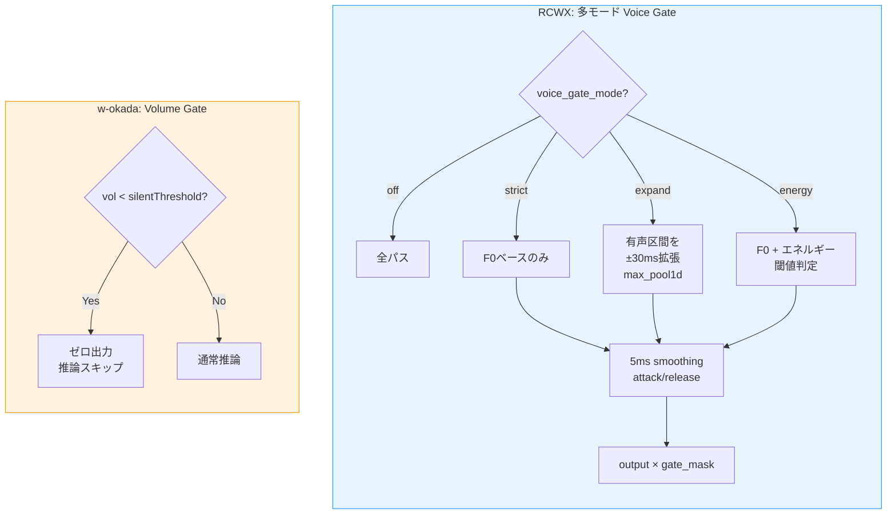

| 観点 | RCWX | w-okada |
|---|---|---|
| 判定基準 | F0 voiced mask + energy | 全体 volume RMS |
| モード数 | 4 (off/strict/expand/energy) | 1 (threshold) |
| 破裂音保護 | expand モードで有声区間を拡張 | なし |
| attack/release | 5ms smoothing convolution | なし |
| 推論スキップ | なし (常に推論実行) | 閾値以下で推論完全スキップ |

w-okada の方式はシンプルだが、推論スキップによる計算節約が可能。RCWX は推論後にゲートを適用するため計算は削減されないが、きめ細かい無声区間制御が可能。

---

## 8. Synthesizer 最小入力長の処理

RVC シンセサイザーのデコーダーは最小入力長を要求する。この制約への対処が異なる。

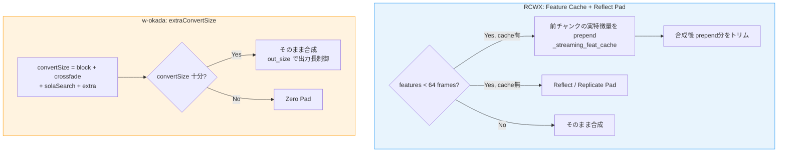

| 観点 | RCWX | w-okada |
|---|---|---|
| 最小フレーム | `MIN_SYNTH_FEATURE_FRAMES = 64` (100fps) | 128-sample アラインメントのみ |
| 不足時の対処 | Feature cache prepend → reflect pad fallback | `extraConvertSize` で通常は不足しない |
| 初回チャンク | Reflect pad (キャッシュ未生成) | Zero pad |
| 品質 | 実特徴量による補完 (高品質) | ゼロ埋めまたは既定コンテキスト |

RCWX の `_streaming_feat_cache` は前チャンクから実際の特徴量 (HuBERT features + pitch + pitchf) を保存し、短チャンク時にデコーダーへの入力を補完する。reflect pad よりもデコーダーが自然な出力を生成できる。

---

## 9. 過負荷保護とフィードバック検出

### 9.1 RCWX 固有の仕組み

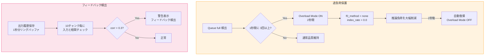

w-okada にはこれらの仕組みが存在しない。推論が遅い場合は sounddevice コールバック内でブロックが発生し、OS レベルでオーディオフレームがドロップされる。

---

## 10. エンドツーエンド レイテンシ構成

### 10.1 レイテンシ内訳

```mermaid
gantt
    title レイテンシ内訳 (典型的な 150ms チャンク設定)
    dateFormat X
    axisFormat %L ms

    section RCWX
    Input Accumulation    :a1, 0, 150
    Inference (async)     :a2, 150, 100
    Output Buffer         :a3, 250, 50

    section w-okada
    Input Capture         :b1, 0, 150
    Inference (sync)      :b2, 150, 120
    Output Queue          :b3, 270, 30
```

| 構成要素 | RCWX | w-okada |
|---|---|---|
| 入力バッファリング | chunk_sec (150ms) | block_frame (設定次第) |
| 推論時間 | 50-100ms (並列抽出) | 80-150ms (直列抽出) |
| 出力バッファ | RingOutputBuffer + prebuffer | outQueue |
| SOLA holdback | crossfade_sec (50ms) | crossfadeFrame (可変) |
| **合計** | **~300ms** | **~350ms** |

RCWX は並列特徴抽出と非同期推論により、同等のチャンクサイズでレイテンシが若干低い。

---

## 11. まとめ

### 11.1 設計哲学の対比

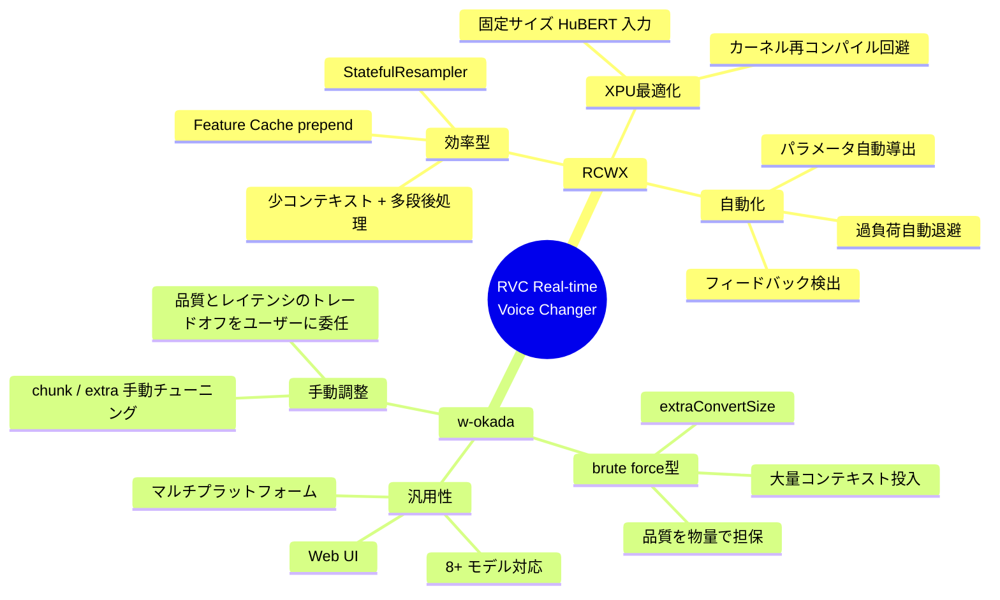

### 11.2 各実装の強み

**RCWX が優れている点**:
- `StatefulResampler` によるチャンク境界のリサンプリング品質
- HuBERT + F0 並列抽出による推論高速化
- F0 後処理 (median + lowpass + octave flip suppress + slew limit) によるピッチ安定性
- 過負荷自動退避とフィードバック検出
- `target_len` による SOLA ドリフト防止
- XPU 向け固定サイズパディング最適化

**w-okada が優れている点**:
- `extraConvertSize` によるユーザー可変コンテキスト (品質チューニングの自由度)
- Pitch Protection (無声子音の index 変換抑制)
- 推論スキップによる計算節約 (silentThreshold)
- cos² + margin 方式の SOLA 窓関数
- Web UI によるリモート操作・複数クライアント対応
- 多モデルフレームワーク対応

### 11.3 RCWX に取り入れる価値のある要素

| 要素                      | 概要                                 | 難易度 |
| ----------------------- | ---------------------------------- | --- |
| **Pitch Protection**    | 無声子音で index features を元特徴量にブレンドバック | 低   |
| **Silent Threshold**    | 音量閾値以下で推論スキップ (計算節約)               | 低   |
| **cos² + margin 窓**     | SOLA 窓関数のフラット区間追加                  | 低   |
| **ユーザー可変コンテキスト**        | `extraConvertSize` 相当のパラメータ公開      | 中   |
| **Quality Repeat Mode** | HuBERT reflection padding の増量オプション | 中   |
